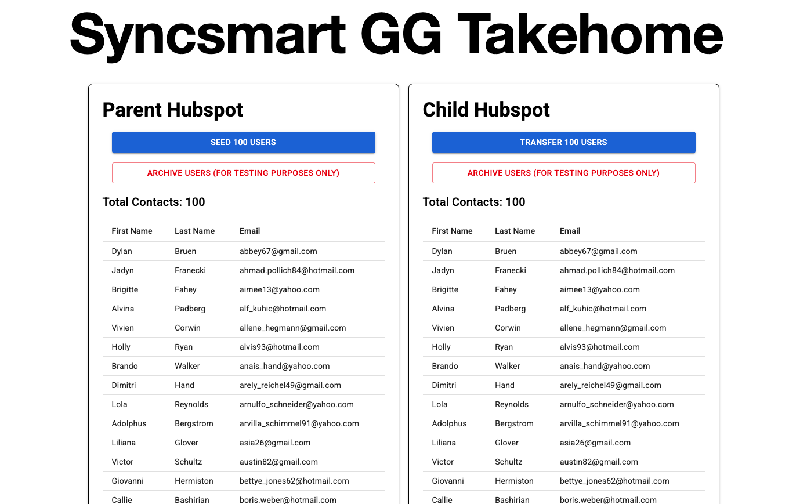

# Syncsmart Takehome Challenge - Gabriel Gutierrez



## Requirements
- ✅ Use https://create.t3.gg/ to initialize a new NextJS app using the "pages" router.
- ✅ Create a developer account in HubSpot. Make two test portals in HubSpot.
- ✅ You can use "private app tokens" to authenticate with HubSpot’s API or go the distance with OAuth.
- ✅ Use MUI (https://mui.com/material-ui/) as your component library.
- ⚠️ Use Typescript to the best of your ability.
- ✅ Find a library for generating fake data and make a page on your app with a button that generates 100 contacts in one of the test accounts. The contacts should at least have a first name, last name and email.
- ✅ Make another button that pulls those contacts from the first HubSpot portal and creates them in the second HubSpot portal.
- ✅ Add spencer@syncsmart.io as a user to your HubSpot test portals.
- ✅ Record and share a video showing your process, results and work. [Loom Video](https://www.loom.com/share/c3d55c3b997c416fb22a296a1fbf357f)

Bonus Points For:
- ❌ Using tRPC (part of the createT3 starter kit)
- ⚠️ Styling the pages and/or rendering more data
- ❌ Authentication (OAuth)
- ✅ A ReadMe that documents the features implemented (Here!)
- 😻 Treat these "requirements" as open-ended and non-strict. The goal is to show off your skills and impress your future co-workers.

My own strech goals:
- Make website typesafe enough to launch on vercel
- Try to figure out pagination/suspend from the next.js library to give 10 per page views of items
- Related: Convert tables to be two client components, allowing the user to sort/fitler/search data on the front end. Right now they are all server components.
- Chain fetch commands to bypass 100 page limit before pagination.

## Overview

My t3 app allows someone to create and store 100 mock users with first names, last names and e-mails in one Hubspot portal. Also it allows one to copy/sync those 100 users to another Hubspot portal. We are accessing the two portals using private apps in Hubspot and using their developer Keys.

## Technology used
- Next.js (through https://create.t3.gg/)
- Typescript (some)
- [Faker.js](https://fakerjs.dev/) (For creating mock data)
- [Material UI](https://mui.com/)
- [Hubspot API](https://developers.hubspot.com/docs/reference/api/overview)

## Commands

### seedUsers()

``` js
export async function seedUsers() {
  const inputs: {
    properties: {
      // Creating the formatted array for input properties for hubspot, could change into an alias later
      email: string;
      firstname: string;
      lastname: string;
    };
  }[] = [];

  for (let i = 0; i < 100; i++) {
    const firstName = faker.person.firstName();
    const lastName = faker.person.lastName();
    const email = faker.internet.email();

    const obj = {
      //creating each property object
      properties: {
        email: email,
        firstname: firstName,
        lastname: lastName,
      },
    };
    inputs.push(obj); //pushing objects into a larger array
  }
  try {
    const res = await axios.post(batchURL, { inputs }, parentHeaders); 
    console.log("Successfully seeded 100 items", res);
    revalidatePath('/'); //refreshes/updates data
  } catch (err) {
    console.error("Error seeding users:", err);
  }
}

```

This creates 100 fake users with first names, last names, and emails. It stores all of these in an array and uses the [https://api.hubapi.com/crm/v3/objects/contacts/batch/create](https://developers.hubspot.com/docs/reference/api/crm/objects/contacts#post-%2Fcrm%2Fv3%2Fobjects%2Fcontacts%2Fbatch%2Fcreate)
batch create endpoint to move them into the Parent Test portal. After the operation is done, it refereshes the server components to show the changes in the database.

---

### syncUsers()

```js
export async function syncUsers() {
  // console.log("clicked!")
  const inputs: {
    properties: {
      // Creating the formatted array for input properties for hubspot, could change into an alias later
      email: string;
      firstname: string;
      lastname: string;
    };
  }[] = [];

  try {
    const fetchResponse = await axios.get(fetchURL, parentHeaders);
    // console.log("fetched: ", fetchResponse.data.results);
    const results = fetchResponse.data.results;

    for (let i = 0; i < results.length; i++) {
      const obj = {
        //creating each property object
        properties: {
          //specifically using email, first and last name, as there are other properties like dates within the object
          email: results[i].properties.email,
          firstname: results[i].properties.firstname,
          lastname: results[i].properties.lastname,
        },
      };
      inputs.push(obj);
    }
    console.log(inputs);

    // Now post the data
    try {
      const postResponse = await axios.post(batchURL, { inputs }, childHeaders);
      console.log("Successfully seeded 100 items to child database", postResponse);
      revalidatePath('/'); //refreshes/updates data
    } catch (err) {
      console.error("Something went wrong with the post request:", err);
    }
  } catch (err) {
    console.error("Something went wrong with the fetch request:", err);
  }
}
```

This command first gets up to 100 items from the parent database using the [/crm/v3/objects/contacts](https://developers.hubspot.com/docs/reference/api/crm/objects/contacts#get-%2Fcrm%2Fv3%2Fobjects%2Fcontacts) endpoint in the parent test portal. It then copies the first name, last name, and email properties and puts them in an array in a greater inputs object. It then uses the [https://api.hubapi.com/crm/v3/objects/contacts/batch/create](https://developers.hubspot.com/docs/reference/api/crm/objects/contacts#post-%2Fcrm%2Fv3%2Fobjects%2Fcontacts%2Fbatch%2Fcreate) endpoint in the child test portal to create 100 duplicate entries in the other portal. It then refreshes the server side components to update the data seen on the page.

---


### archiveParent() / archiveChild()
```js
export async function archiveParent(){
  // console.log("clicked!")
  try {
    const fetchResponse = await axios.get(fetchURL, parentHeaders);
    console.log("fetched: ", fetchResponse.data.results);
    
    const inputs: string[] = []; //creates an array of all the 100 ids inside the database
    for (let i = 0; i < fetchResponse.data.results.length; i++) {
      inputs.push(fetchResponse.data.results[i].id);
      console.log(inputs);
    }

    try {
      const postResponse = await axios.post(archiveURL, { inputs }, parentHeaders);
      console.log("Archived 100 items", postResponse);
      revalidatePath('/'); // Refreshes/updates data
    } catch (err) {
      console.error("Something went wrong with the post request", err);
    }

  } catch (err) {
    console.error("Something went wrong with the fetch request", err);
  }
}
```

For testing purposes only I created a way to batch archive the items I've seeded/synced into either test portal. It'd probably be a bit dangerous to use this outside of a testing enviroment. To do this, I first fetched all the items from a portal using the [/crm/v3/objects/contacts](https://developers.hubspot.com/docs/reference/api/crm/objects/contacts#get-%2Fcrm%2Fv3%2Fobjects%2Fcontacts) endpoint. After that, it populates an array of id numbers, and sends that to the [/crm/v3/objects/contacts/batch/archive](https://developers.hubspot.com/docs/reference/api/crm/objects/contacts#post-%2Fcrm%2Fv3%2Fobjects%2Fcontacts%2Fbatch%2Farchive) batch archive endpoint. It then refreshes the server side components to update the data seen on the page.

---

# Post MVP Goals